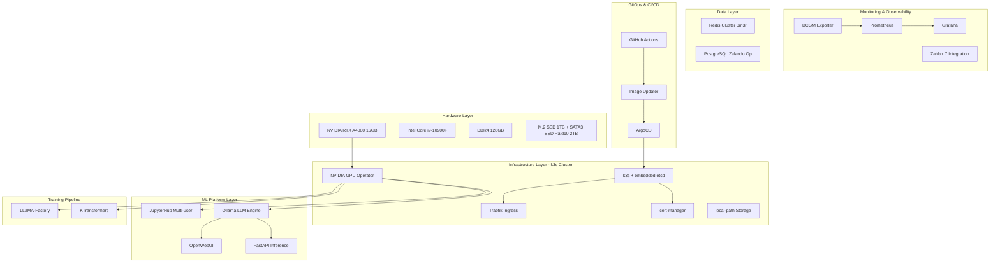

# aicc-mlops-platform
Production-ready K8s + MLOps platform on single-node with GPU support

#  AI Computing Center MLOps Platform

[](https://opensource.org/licenses/bsd-3-clause)
[](https://k3s.io/)
[](https://www.nvidia.com/)
[](https://argoproj.github.io/)
[](https://www.python.org/)

> **Production-ready Kubernetes + MLOps platform on a single powerful workstation**  

[English](#english) | [繁體中文](./README.zh-TW.md)

---

##  Overview

This repository demonstrates a **complete enterprise-grade AI/ML infrastructure** built on a single high-performance desktop. 

###  Project Goals

- **For Engineers**: Provide a replicable blueprint for building ML platforms on limited hardware
- **For Managers**: Demonstrate end-to-end planning from infrastructure to business roadmap

###  Key Features

-  **Single-node k3s HA cluster** with embedded etcd
-  **NVIDIA GPU Operator** with time-slicing for multi-user GPU sharing
-  **Full GitOps workflow** using ArgoCD + GitHub Actions
-  **Production-grade monitoring** with Prometheus, Grafana, DCGM Exporter
-  **Multi-user JupyterHub** with GPU-aware spawning profiles
-  **LLM inference stack** using Ollama + OpenWebUI + FastAPI
-  **Fine-tuning pipeline** with LLaMA-Factory + KTransformers
-  **Security hardening**: NetworkPolicy, PodSecurityStandards, Trivy scanning
-  **Management documentation**: 12-month roadmap, budget planning, executive summaries

---

##  Architecture


---

##  Hardware & System Specifications

|   Component    |         Specification         |
|----------------|-------------------------------|
| **CPU**        | Intel core i9-10900F (10C/20T)|
| **RAM**        | DDR4 128GB                    |
| **GPU**        | NVIDIA RTX A4000 16GB         |
| **Storage1**   | M.2 SSD 1TB                   |
| **Storage2**   | SATA3 SSD RAID 10 2TB         |
| **Network**    | 1Gbps                         |
| **OS**         | Ubuntu 24.04 LTS              |
| **Monitoring** | Zabbix 7 (pre-installed)      |

---

##  Technology Stack

### Infrastructure & Orchestration
- **Kubernetes**: k3s v1.28+ (single-node HA with embedded etcd)
- **GPU**: NVIDIA GPU Operator v23.9+, GPU time-slicing, DCGM Exporter
- **Ingress**: Traefik v2.10+ with Let's Encrypt TLS
- **Storage**: local-path-provisioner, future NFS/Longhorn support
- **GitOps**: ArgoCD v2.9+, ArgoCD Image Updater

### Data & Caching
- **Database**: PostgreSQL 15+ (Zalando Operator)
- **Cache**: Redis Cluster 7+ (3 master + 3 replica)

### ML/AI Platform
- **Notebooks**: JupyterHub with Zero to JupyterHub Helm chart
- **LLM Inference**: Ollama, OpenWebUI, FastAPI
- **Training**: LLaMA-Factory, KTransformers, LoRA/QLoRA

### Observability
- **Metrics**: Prometheus, Grafana, DCGM Exporter
- **Existing**: Zabbix 7 (host-level monitoring)

### Security & Quality
- **Container Scanning**: Trivy in CI
- **Image Hardening**: Multi-stage builds, distroless base images
- **Network**: NetworkPolicy, PodSecurityStandards
- **Resource Control**: ResourceQuota, LimitRange, PriorityClass

---

##  Quick Start

### Prerequisites
```bash
# Verify system
cat /etc/os-release | grep "Ubuntu 24.04"
nvidia-smi  # Should show your vga gpu
```

### One-Command Deployment
```bash
# Clone repository
git clone https://github.com/gh-range/aicc-mlops-platform.git
cd aicc-mlops-platform

# Run bootstrap script
./scripts/setup/bootstrap.sh

# Deploy all services via ArgoCD
kubectl apply -f apps/argocd/root-app.yaml
```

### Access Services

| Service | URL | Credentials |
|---------|-----|-------------|
| ArgoCD | https://argocd.<domain> | `admin` / (see secret) |
| Grafana | https://grafana.<domain> | `admin` / (see secret) |
| JupyterHub | https://jupyter.<domain> | GitHub OAuth |
| OpenWebUI | https://chat.<domain> | Sign up |

---

##  Documentation Structure
```
docs/
├── architecture/
│   ├── system-overview.md          # High-level architecture
│   ├── network-topology.md         # Network design
│   └── gpu-scheduling.md           # GPU time-slicing strategy
├── design-decisions/
│   ├── 01-why-k3s.md              # Why k3s vs k8s/RKE2
│   ├── 02-gpu-operator.md         # GPU management approach
│   ├── 03-jupyterhub-vs-slurm.md  # Multi-user platform choice
│   └── 04-gitops-workflow.md      # CI/CD strategy
├── executive-summaries/
│   ├── Q1-2026-infrastructure.md   # Quarterly report template
│   └── business-value.md           # ROI and cost analysis
├── operating-plan.md               # 12-month roadmap + budget
└── runbooks/
    ├── gpu-troubleshooting.md
    ├── backup-restore.md
    └── scaling-guide.md
```

---

##  Management-Level Deliverables

This repository includes deliverables designed for **leadership positions**:

### 1. Architecture Decision Records (ADRs)
Every major technology choice is documented with:
- Problem statement
- Considered alternatives
- Decision rationale (cost, scalability, team size)
- Consequences and trade-offs

**Example**: [Why k3s instead of full Kubernetes?](docs/design-decisions/01-why-k3s.md)

### 2. 12-Month Operating Plan
Includes:
- Hardware expansion roadmap
- Budget breakdown (compute, network, power, cooling)
- Team structure proposal (Platform, ML, DevOps teams)
- Risk matrix and mitigation strategies

**See**: [docs/operating-plan.md](docs/operating-plan.md)

### 3. Executive Summaries
Quarterly slide decks (Markdown + Mermaid) for board presentations:
- Infrastructure health metrics
- Cost per GPU-hour
- Team productivity improvements
- Upcoming investments

---

##  Security & Best Practices

-  All secrets managed via Kubernetes Secrets (future: Sealed Secrets/Vault)
-  NetworkPolicy enforcing zero-trust networking
-  PodSecurityStandards (restricted profile)
-  All images scanned with Trivy in CI
-  Resource limits on all workloads
-  PodDisruptionBudget for critical services
-  Automated certificate rotation via cert-manager

---

##  Monitoring & Alerts

### GPU Metrics (DCGM Exporter → Prometheus)
- GPU utilization per user
- Memory usage
- Temperature and power consumption
- SM clock frequency

### Application Metrics
- Ollama inference latency
- JupyterHub active users
- Redis/PostgreSQL health

### Integration with Zabbix
- Host-level metrics (CPU, memory, disk)
- Hardware health (RAID status, temperature)
- Network throughput

---

##  Testing & Validation
```bash
# Run integration tests
make test

# Validate all YAML manifests
make validate

# Lint Dockerfiles
make lint-docker
```

---

##  Roadmap

- [ ] **Phase 1**: Core infrastructure (k3s, GPU Operator, monitoring)
- [ ] **Phase 2**: GitOps workflow (ArgoCD, CI/CD)
- [ ] **Phase 3**: ML platform (JupyterHub, Ollama, training pipeline)
- [ ] **Phase 4**: Multi-node expansion (3-node cluster)
- [ ] **Phase 5**: Advanced features (Kubeflow, MLflow, model registry)
- [ ] **Phase 6**: Commercial GPU rental platform integration

**See detailed roadmap**: [docs/operating-plan.md](docs/operating-plan.md)

---

##  Contributing

This is a portfolio project, but contributions are welcome!  
Please read [CONTRIBUTING.md](CONTRIBUTING.md) for guidelines.

---

##  License

This project is licensed under the 3-Clause BSD License - see the [LICENSE](LICENSE) file for details.

---

##  Author

** Range **  
AI Infrastructure Engineer | MLOps Specialist

---

##  Acknowledgments

- [k3s](https://k3s.io/) - Lightweight Kubernetes
- [NVIDIA GPU Operator](https://github.com/NVIDIA/gpu-operator) - GPU orchestration
- [ArgoCD](https://argoproj.github.io/) - GitOps continuous delivery
- [Zero to JupyterHub](https://z2jh.jupyter.org/) - Multi-user Jupyter
- [LLaMA-Factory](https://github.com/hiyouga/LLaMA-Factory) - LLM fine-tuning
- [KTransformers](https://github.com/kvcache-ai/ktransformers) - LLM Inference/Fine-tune Framework

---

<div align="center">

** If you find this project helpful, welcome to giving it a star :) **

</div>
