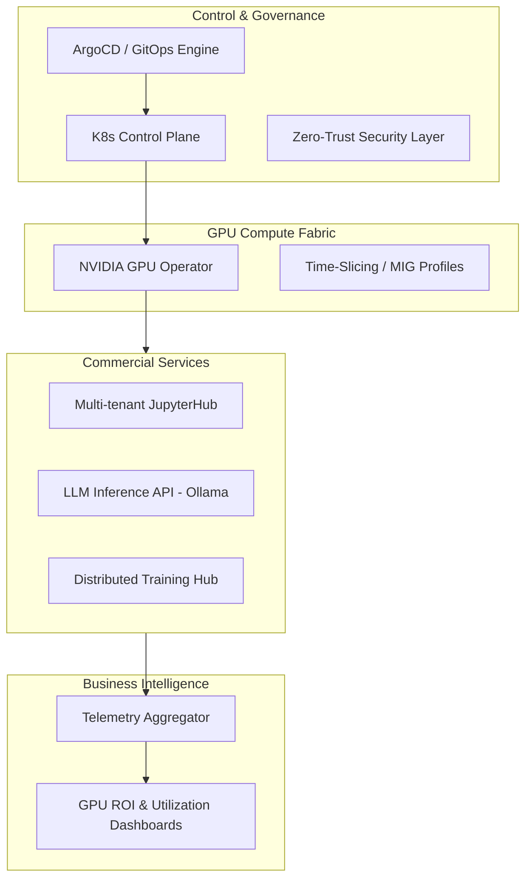

# Enterprise AICC MLOps Platform: Strategic Reference Architecture

**A production-ready, GitOps-driven Kubernetes MLOps framework designed for high-utilization GPU orchestration. Engineered for seamless transition from Micro-node Validation to Tier-4 Data Center SuperPod deployments (NVIDIA H200/B200/B300).**

[](https://opensource.org/licenses/bsd-3-clause)
[](https://k3s.io/)
[](https://docs.nvidia.com/datacenter/cloud-native/gpu-operator/latest/index.html)
[](https://argoproj.github.io/cd/)

---

## Executive Summary

This repository provides a comprehensive **Architecture Blueprint** for AI Computing Centers (AICC) seeking to maximize GPU ROI through rental services or internal private clouds. 

As a **Micro-Architecture Validation (MAV)** implementation, this project demonstrates a fully functional control plane and orchestration layer. It serves as the technical foundation for large-scale commercial clusters, ensuring that deployment logic, security policies, and observability stacks are validated before scaling to InfiniBand-linked SuperPod environments.

### Strategic Value Propositions

* **Accelerated TTM (Time-to-Market):** Standardized GitOps workflows reduce cluster provisioning time from days to hours.
* **Optimized TCO (Total Cost of Ownership):** High-density GPU utilization via NVIDIA time-slicing and multi-tenant resource quotas.
* **Operational Excellence:** Zero-touch deployment cycles using declarative state management (ArgoCD).
* **Future-Proof Scalability:** Architectural parity between the validation node and H200/B200/B300 SuperPod configurations.

## Architecture & Logic

The platform utilizes a modular "Cellular" design. The validation cell (current) maps 1:1 to the logic required for multi-node production environments.



## Governance & Engineering Standards

For a detailed breakdown of the management-level technical decisions, refer to the following documentation:

* **Architecture Decision Records (ADRs):** Rationalizing the choice of lightweight K3s for orchestration and GPU time-slicing for multi-tenancy.
* **Operating Plan:** 12-month scaling roadmap, including transition to RDMA/InfiniBand fabrics and high-performance distributed storage.
* **Security Posture:** Implementation of PodSecurityStandards (Restricted) and default NetworkPolicies to ensure a multi-tenant "Zero-Trust" environment.

## Validation Node vs. Production Scaling

| Feature | Validation Node (Current) | Commercial SuperPod (Target) |
| --- | --- | --- |
| **Compute** | Single-node x86 | Multi-node HA Cluster (99.99% SLA) |
| **Accelerator** | NVIDIA Ampere/Ada | NVIDIA H200 / B200 / B300 NVLink |
| **Networking** | Standard Ethernet | InfiniBand / RDMA Fabric |
| **Orchestration** | K3s (Embedded etcd) | Upstream K8s (External HA etcd) |
| **Observability** | Per-GPU Tracking | Per-Tenant / Per-Project Billing & ROI |

## Deployment Logic

The entire environment is bootstrapped via a single entry point, ensuring consistency across development, staging, and production tiers.

```bash
git clone [https://github.com/gh-range/aicc-mlops-platform.git](https://github.com/gh-range/aicc-mlops-platform.git)
cd aicc-mlops-platform
./scripts/setup/bootstrap.sh

```

## Roadmap: The Path to SuperPod

* **Phase 1:** Core Infrastructure validation & GitOps workflow.
* **Phase 2:** Transition to 3-node HA with distributed storage (Ceph/Longhorn).
* **Phase 3:** Integration of NVIDIA Magnum IO & GPUDirect Storage for SuperPod scale.
* **Phase 4:** Implementation of commercial billing APIs and multi-region federation.

---

**License:** BSD 3-Clause. Designed for commercial adaptability.

