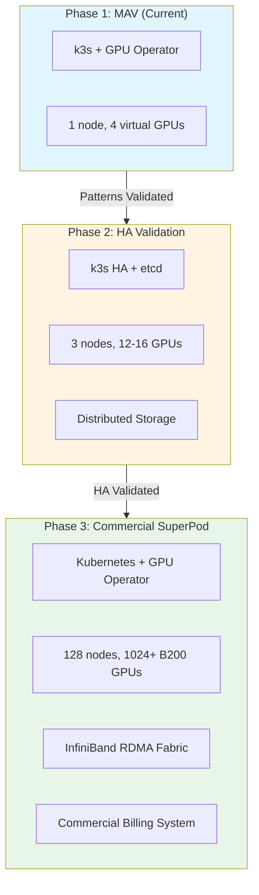

# Enterprise AICC MLOps Platform: Strategic Reference Architecture

**A production-ready, GitOps-driven Kubernetes MLOps framework designed for high-utilization GPU orchestration. Engineered as a phased validation pathway from single-node prototyping to 128-node NVIDIA B200 SuperPod deployments (1024+ GPU commercial infrastructure).**

[](https://opensource.org/licenses/bsd-3-clause)
[](https://k3s.io/)
[](https://docs.nvidia.com/datacenter/cloud-native/gpu-operator/latest/index.html)
[](https://argoproj.github.io/cd/)

---

## Executive Summary

This repository documents the complete architectural blueprint for an **AI Computing Center (AICC)** designed to deliver GPU-as-a-Service for external customers or enterprise private cloud deployments.

### Strategic Deployment Phases

**Phase 1: Micro-Architecture Validation (MAV)** - *Current*
- **Scale**: Single-node prototype (RTX A4000)
- **Purpose**: Validate orchestration patterns, multi-tenancy, and GitOps workflows
- **Investment**: Zero software licensing, minimal infrastructure
- **Timeline**: 6 months

**Phase 2: High-Availability Validation** - *Q3-Q4 2026*
- **Scale**: 3-node cluster (12-16 GPUs)
- **Purpose**: Validate HA control plane, distributed storage, and fault tolerance
- **Investment**: Strategic hardware expansion
- **Timeline**: 3-6 months

**Phase 3: Commercial SuperPod Deployment** - *2027+*
- **Scale**: 128-node NVIDIA B200 cluster (1024+ GPUs)
- **Purpose**: Production GPU rental services or enterprise private cloud
- **Target Utilization**: >80% for commercial profitability
- **Revenue Model**: GPU-as-a-Service ($2-4/GPU-hour market rates)

**Key Principle**: Each phase validates the architecture and operational patterns required for the next scale, ensuring zero technical debt and seamless migration paths.

---

## Strategic Value Propositions

### For MAV Phase (Current)
* **Risk Mitigation**: Validate $0-cost open-source stack before multi-million dollar SuperPod investment
* **Architectural Parity**: All patterns (ResourceQuotas, time-slicing, GitOps) proven to work identically at SuperPod scale
* **Team Readiness**: Build operational expertise without commercial licensing pressure
* **Flexibility**: Defer vendor selection (Run:AI, custom scheduler) until commercial requirements crystallize

### For Commercial Phase (Target)
* **TCO Optimization**: Self-managed stack estimated at 40-50% lower TCO vs commercial platforms (see ADR-005)
* **Vendor Independence**: No platform lock-in; can adopt Run:AI or similar if ROI justifies licensing costs
* **Competitive Positioning**: On-premise deployment avoids cloud egress fees and enables sub-$3/GPU-hour pricing
* **Enterprise Credibility**: Proven reference architecture for Fortune 500 private cloud deployments

---

## Architecture & Scaling Logic

The platform utilizes a **"Cellular Replication"** design pattern. Each validated cell (MAV → HA → SuperPod) inherits the identical control plane logic, differing only in scale and hardware specifications.



### Architectural Consistency Guarantees

| Component | MAV | HA | SuperPod | Migration Path |
|-----------|-----|-----|----------|----------------|
| **Orchestration** | k3s | k3s | Kubernetes | CNCF conformant (ADR-005) |
| **GPU Management** | GPU Operator | GPU Operator | GPU Operator | Identical Helm config |
| **Multi-tenancy** | ResourceQuota | ResourceQuota | ResourceQuota + MIG | Additive upgrade |
| **GitOps** | ArgoCD | ArgoCD | ArgoCD | Same ApplicationSets |
| **Monitoring** | Prometheus/Grafana | Prometheus/Grafana | Prometheus/Grafana | Metrics remain identical |
| **Networking** | Traefik | Traefik + MetalLB | Traefik + InfiniBand | Layer 7 logic unchanged |

**Zero Rework Guarantee**: No architectural rewrites required between phases; only hardware and scale parameters change.

---

## Why Not Start with Commercial Platforms?

### Run:AI vs k3s + GPU Operator Analysis

Based on **ADR-005: Orchestration Platform Comparison**, we defer commercial platform adoption to Phase 3 for the following reasons:

**Cost Efficiency**:
- Run:AI licensing: ~$1.25M/year for 1024 GPUs
- k3s + GPU Operator: $0/year + engineering investment
- **Decision**: Validate architecture at zero cost; license commercial tools only when ROI is proven

**Learning Depth**:
- Building on native Kubernetes deepens team expertise (critical for 1024-GPU troubleshooting)
- Commercial platforms abstract away details needed for SuperPod-scale debugging

**Vendor Lock-In Risk**:
- Run:AI uses proprietary CRDs (`RunaiJob`) instead of native Kubernetes `Job`
- Premature adoption creates migration costs if business model pivots (rental vs private cloud)

**Migration Path**: See ADR-005 for detailed k3s → k8s → Run:AI migration analysis and cost modeling.

---

## Governance & Engineering Standards

All technical decisions are documented following enterprise architectural governance:

* **[ADR-001](docs/design-decisions/ADR-001-why-k3s.md)**: k3s selection rationale and k8s migration path
* **[ADR-004](docs/design-decisions/ADR-004-gpu-operator-deployment.md)**: GPU Operator strategy and B200 MIG planning
* **[ADR-005](docs/design-decisions/ADR-005-orchestration-platform-comparison.md)**: Run:AI vs k3s TCO analysis and hybrid adoption strategy
* **[Operating Plan](docs/operating-plan.md)**: 12-month MAV → HA roadmap with Q4 2026 decision gate for Phase 3
* **[Scaling Roadmap](docs/architecture/scaling-roadmap.md)**: Technical requirements for each phase (MAV → HA → SuperPod)

---

## Current State (Phase 1: MAV)

### Validated Capabilities
- [o] GPU Time-Slicing (1 physical → 4 virtual GPUs)
- [o] Multi-tenant ResourceQuotas (namespace isolation)
- [o] Concurrent workload scheduling (4/4 GPU utilization)
- [o] JupyterHub integration (GitHub OAuth, GPU allocation)
- [o] GitOps workflow (ArgoCD ApplicationSets)
- [o] DCGM metrics pipeline (Prometheus integration)

### Production Readiness Scorecard
| Category | Status | Evidence |
|----------|--------|----------|
| GPU Orchestration | [o] Production | 4 concurrent pods validated |
| Multi-tenancy | [o] Production | ResourceQuota enforcement tested |
| Monitoring | [o] Production | DCGM + Prometheus integrated |
| Documentation | [o] Production | 5 ADRs + operational runbooks |
| High Availability | [!] Deferred | Phase 2 milestone (Q3 2026) |
| Commercial Billing | [!] Deferred | Phase 3 milestone (2027) |

---

## Deployment

### Quick Start (MAV Replication)
```bash
git clone https://github.com/gh-range/aicc-mlops-platform.git
cd aicc-mlops-platform
./scripts/setup/bootstrap.sh
```

### Hardware Requirements
- **Minimum**: 1 node, 8-core CPU, 64GB RAM, 1 GPU (NVIDIA Ampere/Ada/Blackwell)
- **Recommended (HA)**: 3 nodes, 128GB RAM per node, NVIDIA GPUs
- **Production (SuperPod)**: 128 nodes, NVIDIA DGX B200 (8 GPUs per node), InfiniBand fabric

---

## Roadmap & Decision Gates

### Q1-Q2 2026: MAV Completion
- [o] GPU Time-Slicing validation
- [o] Multi-tenant isolation
- [ ] ArgoCD full GitOps workflow
- [ ] Disaster recovery (Velero)
- **Decision Gate**: Proceed to HA phase if >90% test coverage achieved

### Q3-Q4 2026: HA Validation
- [ ] 3-node k3s HA cluster
- [ ] etcd backup/restore tested
- [ ] Distributed storage (Longhorn/Ceph)
- [ ] Custom fair-share scheduler (or Volcano adoption)
- **Decision Gate**: Evaluate Run:AI vs custom platform for Phase 3

### 2027: Commercial SuperPod
- [ ] Data center site preparation (power, cooling, InfiniBand)
- [ ] 128-node B200 procurement and deployment
- [ ] Kubernetes upgrade (k3s → standard k8s or RKE2)
- [ ] Commercial billing system integration
- [ ] SLA framework (99.99% uptime target)
- **Revenue Target**: Break-even within 18 months of launch

---

## Commercial Deployment Model

### Target Markets
1. **GPU Rental (Primary)**: On-demand or reserved instances for ML/AI workloads
2. **Enterprise Private Cloud (Secondary)**: Managed GPU infrastructure for Fortune 500
3. **Research Institutions**: Academic pricing tier for universities/labs

### Competitive Positioning
| Provider | Rate (V100 equivalent) | Our Target (B200) |
|----------|------------------------|-------------------|
| AWS p3.2xlarge | $3.06/hour | $2.50-3.50/hour |
| Azure NC6s v3 | $3.06/hour | $2.50-3.50/hour |
| Lambda Labs | $1.10/hour (spot) | $2.00-2.50/hour |

**Differentiation**: Lower egress costs, enterprise SLA, dedicated support, on-premise option.

---

## Technical Debt & Known Limitations

### Current Limitations (MAV)
- Single node (no HA)
- Time-Slicing only (no MIG support until Phase 3)
- Manual chargeback tracking (commercial dashboard in Phase 3)

### Planned Migrations
- **k3s → k8s**: Well-documented CNCF-conformant migration (ADR-005)
- **Time-Slicing → MIG**: Identical GPU Operator config, just different device plugin mode
- **Manual → Automated Billing**: Integration points already defined (Prometheus metrics)

**Technical Debt Score**: Low (all components follow CNCF standards; no proprietary lock-in)

---

## Team & Hiring Roadmap

| Phase | Team Size | Roles |
|-------|-----------|-------|
| MAV (Current) | 1 engineer | Full-stack infrastructure |
| HA (Q3 2026) | 3 engineers | +DevOps, +ML Platform Engineer |
| SuperPod (2027) | 10-15 engineers | +SREs, +Security, +Support, +Sales Engineering |

**Hiring Trigger**: Validated architecture + secured Phase 3 funding.

---

## License & Commercial Use

**License**: BSD 3-Clause (permissive, commercial-friendly)

This reference architecture is designed for adaptation by:
- Cloud providers building GPU rental platforms
- Enterprises deploying private AI clouds
- System integrators offering managed GPU services

**Attribution requested, not required.** Contributions welcome via pull requests.

---

## References & Further Reading

- [NVIDIA DGX B200 Platform Guide](https://www.nvidia.com/en-us/data-center/dgx-b200/)
- [NVIDIA GPU Operator Documentation](https://docs.nvidia.com/datacenter/cloud-native/gpu-operator/latest/)
- [k3s Production Deployment Guide](https://docs.k3s.io/architecture)
- [CNCF Cloud Native Maturity Model](https://maturitymodel.cncf.io/)
- [Run:AI Platform Comparison (PDF)](https://pages.run.ai/hubfs/PDFs/RunAI-Platform-vs-Kubernetes.pdf)

---

<div align="center">

**Current Phase**: MAV (Single-Node Validation)  
**Next Milestone**: Q3 2026 - HA Cluster Deployment  
**Target Commercial Launch**: Q1 2027 - 128-node B200 SuperPod

**Questions?** Open an issue or review [ADR-005](docs/design-decisions/ADR-005-orchestration-platform-comparison.md) for platform selection rationale.

</div>

