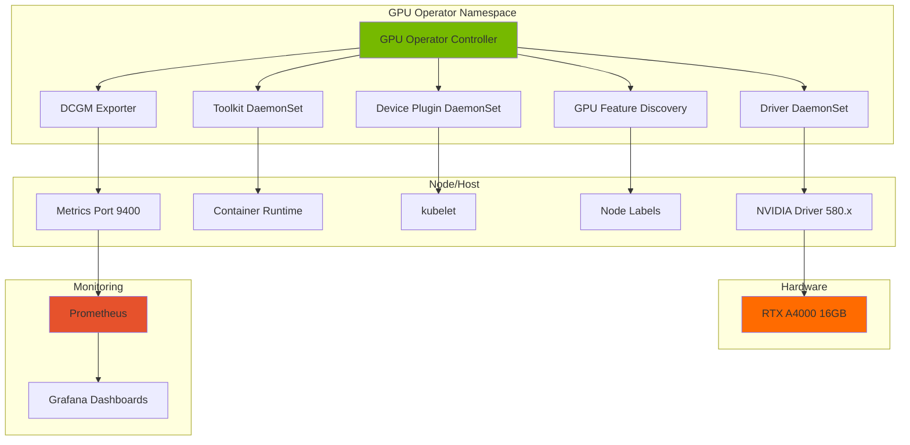
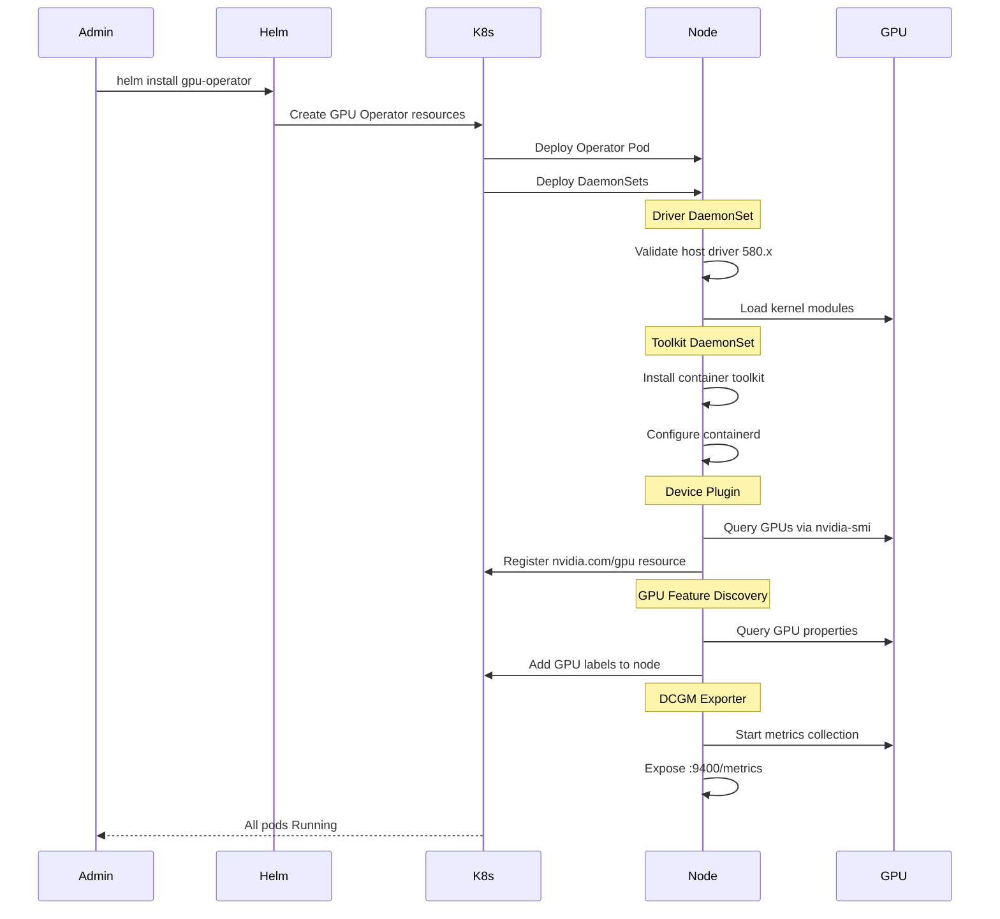
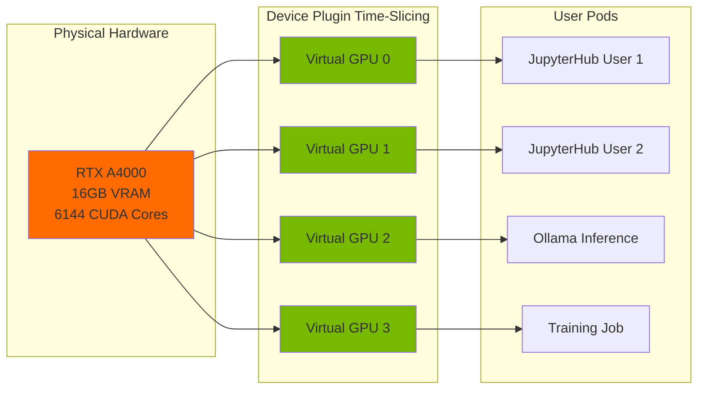
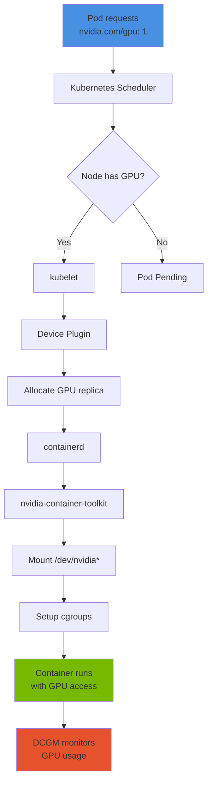
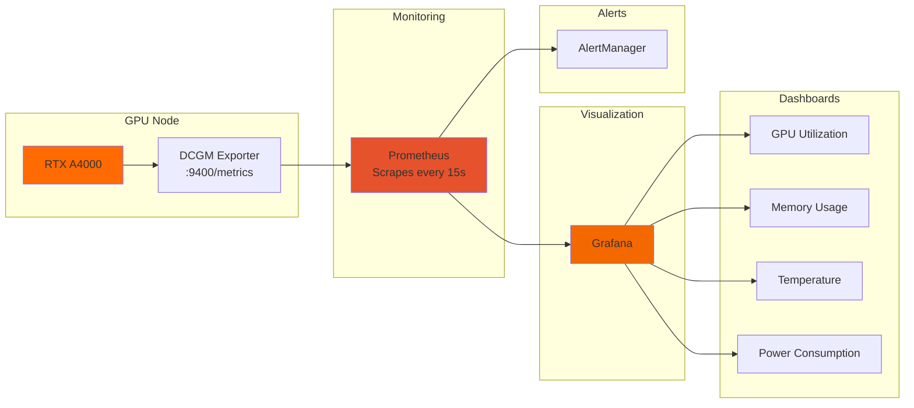
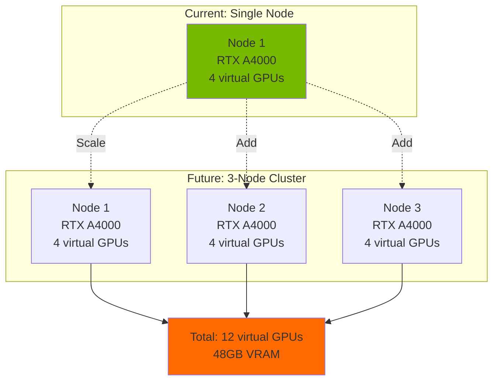
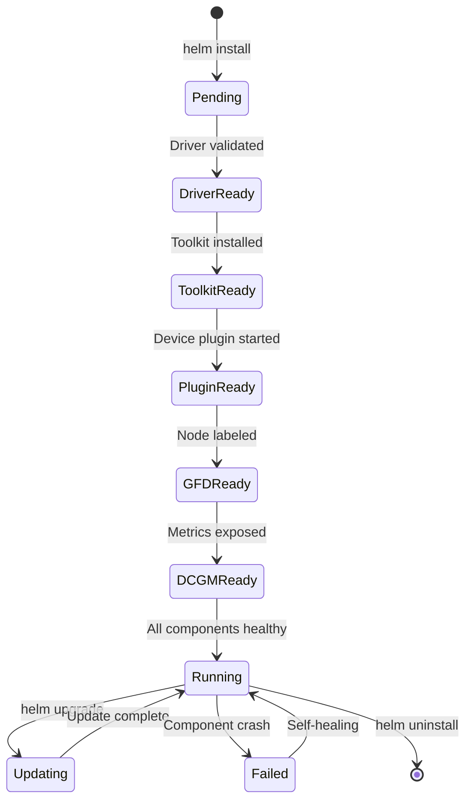

# GPU Operator Architecture Diagrams

This document contains visual representations of GPU Operator architecture for presentations and documentation.

---

## Component Relationship Diagram

---

## Deployment Flow Diagram

---

## GPU Time-Slicing Architecture

---

## Request Flow: Pod to GPU

---

## Monitoring Stack Integration

---

## Multi-Node Expansion (Future)

---

## Component Lifecycle

---

## Usage in Documentation

These diagrams are referenced in:
- Architecture design documents
- Deployment runbooks
- Team training materials
- Interview presentations
- Executive summaries

To render these diagrams:
- GitHub/GitLab automatically render Mermaid in markdown
- Use Mermaid Live Editor: https://mermaid.live
- Export as PNG/SVG for presentations
