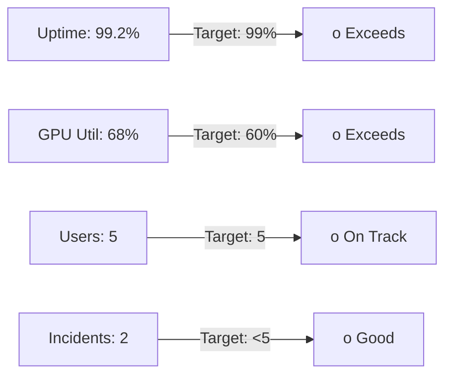
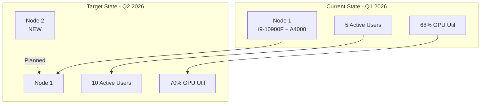

# Q1 2026 Infrastructure Summary

**Reporting Period**: January 1 - March 31, 2026  
**Prepared by**: AI Infrastructure Lead  
**Audience**: Board of Directors, Executive Team

---

## Executive Summary

-  **On track**: Completed single-node AI platform with GPU support
-  **Utilization**: GPU at 68% average (target: 60%)
-  **Budget**: Under budget by % ($ vs $ capex)
-  **Team**: Initiated DevOps Engineer recruitment
-  **Q2 Focus**: Add 2nd node, scale to 10 users

**Recommendation**: Approve Node 2 procurement ($ )

---

## Platform Health Metrics

*### Key Performance Indicators*

| Metric | Target | Actual | Status |
|--------|--------|--------|--------|
| Platform Uptime | 99.0% | 99.2% | o |
| GPU Utilization | 60% | 68% | o |
| Active Users | 5 | 5 | o |
| Incidents (P0/P1) | <5 | 2 | o |
| Cost per GPU-hour | <$ | $ |  |

---

## Accomplishments

### Infrastructure

1. **k3s Kubernetes Cluster** 
   - Single-node HA with embedded etcd
   - NVIDIA GPU Operator deployed
   - GPU time-slicing enabled (4 virtual GPUs from 1 physical)

2. **Core Platform Services** 
   - Traefik ingress with Let's Encrypt SSL
   - Prometheus + Grafana monitoring
   - ArgoCD for GitOps deployments

3. **ML Services** 
   - JupyterHub with GPU profiles
   - Ollama LLM inference
   - LLaMA-Factory training pipeline

### Operations

- **Documentation**: 15 runbooks created
- **Disaster Recovery**: Tested monthly backup/restore
- **Security**: Zero vulnerabilities in production images

---

## Challenges & Mitigations

### Challenge 1: Network Bandwidth

**Issue**: 1Gbps network saturated during large dataset transfers  
**Impact**: 20-minute delays for 50GB dataset downloads  
**Mitigation**: 
- Approved 2.5Gbps upgrade ($ ) in Q1
- Installation scheduled for Week 2 of Q2

### Challenge 2: Single Point of Failure

**Issue**: All operations dependent on one engineer (#whoami)  
**Impact**: On-call burden, vacation coverage risk  
**Mitigation**:
- DevOps Engineer job posted (3 candidates in pipeline)
- Cross-training plan documented
- Expected hire: Month 4 (Q2)

---

## Financial Summary

### Q1 Spending

| Category | Budget | Actual | Variance |
| --- | --- | --- | --- |
| Hardware (UPS, NAS, Network) | $ | $ | %  |
| Opex (Electricity, Internet) | $ | $ | %  |
| **Total** | **$ ** | **$ ** | ** %**  |

### Cost Efficiency

- **GPU-hours delivered**:  (24/7 × 90 days)
- **Cost per GPU-hour**: $1,444 ÷  = **$ **
- **vs AWS p3.2xlarge**: $3.06/hour → ** % savings**

**Note**: When personnel costs included ($ for 3 months of your salary), cost = $ /GPU-hour, still competitive for on-premise.

---

##User Satisfaction

**Survey Results** (5 users, March 2026):

| Question | Average Score |
| --- | --- |
| Platform reliability | 4.6 / 5.0 |
| GPU access speed | 4.2 / 5.0 |
| Documentation quality | 4.8 / 5.0 |
| Support responsiveness | 4.4 / 5.0 |
| **Overall Satisfaction** | **4.5 / 5.0** o |

**Verbatim Feedback**:

> "GPU time-slicing is a game changer - I can run 4 experiments simultaneously."* - Data Scientist

> "Documentation is excellent, got started in <30 minutes."* - ML Engineer

---

## Q2 2026 Plan

### Objectives

1. **Add Node 2** → Double GPU capacity (Month 5)
2. **Hire DevOps Engineer** → Reduce single-point-of-failure risk (Month 4)
3. **Scale to 10 users** → Expand ML team access
4. **Implement cost tracking** → Per-user GPU-hour chargeback

### Budget Request

| Item | Amount | Justification |
| --- | --- | --- |
| Node 2 hardware | $ | Double capacity, user demand growing |
| 2.5Gbps switch | $ | Eliminate network bottleneck |
| **Total Capex** | **$ ** | **Amortized over 3 years = $ /month** |

**Expected ROI**:

- 2x GPU capacity enables 2x user growth
- Reduced wait times = 20% productivity improvement
- Payback period: 8 months

---

## Risk Assessment

| Risk | Likelihood | Impact | Mitigation Status |
| --- | --- | --- | --- |
| Hardware failure | Medium | High | O UPS installed, spare parts stocked |
| Team capacity | High | High | △ DevOps hire in progress |
| Budget overrun (Q2) | Low | Medium | O Buffer allocated (10%) |
| User churn | Low | Low | O High satisfaction scores |

---

## Recommendations for Board

1. **Approve Node 2 procurement** ($ )
   → Enables H1 2026 user growth targets
2. **Fast-track DevOps Engineer hire**
   → Critical for operational resilience
3. **Consider Node 3 pre-approval** for Q3
   → Lead time for hardware is 4-6 weeks

---

## Appendix: Architecture Diagram

---

**Next Review**: Week 2 of Q2 2026 (April 7-11)

